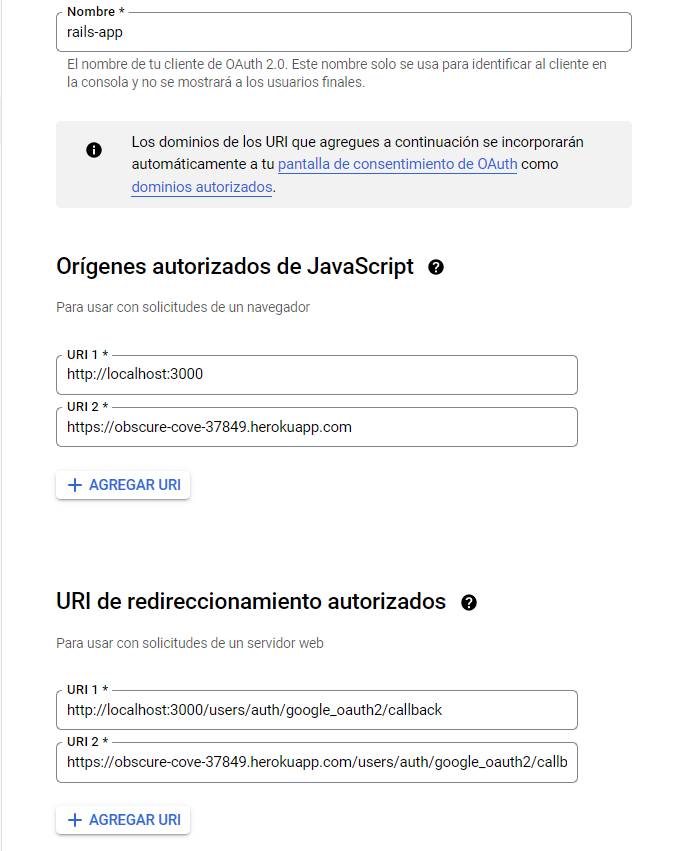

# Omniauth Google Account

This app was developed using Ruby on Rails 6.

## Software.

* Ruby 3.0
* Ruby on Rails 6.1.4.7
* Windows 10
* Heroku App.
* PostreSQL.
* VS Code.


## Description.

In order to developed this app, you will need to follow the next steps.
You must have access to Google Console to create the credentials.

### Setting Gemfile.

First of all, we need to add these gems into our Gemfile

* gem "omniauth-rails_csrf_protection"
* gem 'omniauth-google-oauth2'
* gem 'devise'
* gem 'sqlite' <-- Development group.
* gem 'pg' <-- Production group.

After that, run the command:
`bundle install --without production`

### Pages controller

I created a pages controller with the home page.
Go to routes.rb and set a page as the root of your application

### Heroku App.

Make a commit of your code and create a heroku app by typing the command: `heroku create`
Once you've done that, upload your code to production: `git push heroku master`

### Creaing Google Credentials.

Go to: https://console.cloud.google.com and sign up.
Go to **API and Services**, click on **Credentials** and select **ID Auth Client**.
You will need to create consent in order to create your credentials.
I suggest you select in create button within the consent page. It's easy to set all the configuration up.
You will have to name your web application and set the URI:

Javascript.

* http://localhost:3000
* https://obscure-cove-37849.herokuapp.com

URI

* http://localhost:3000/users/auth/google_oauth2/callback
* https://obscure-cove-37849.herokuapp.com/users/auth/google_oauth2/callback



Finally, you will need to copy the client ID and the secret ID.


## Rails Credentials.

Copy the keys generated in Google Console and paste it into your credentials file.
Use this command in order to open your credentials file: `EDITOR="code --wait" rails credentials:edit`

* google_id: 'Here goes the id client'
* google_secret: 'Here goes the secret key'

Once you've done that, save and close the file.
Use this command to see your credetnials: `rails credentials:show`

You can verify your credentials by openning rails console and
typing the next commands: `Rails.application.credentials.google_id`

## Generate Devise Model.

Run this command in order to install devise: `rails g devise:install`
Run this command to generate User model: `rails g devise User`
Run this command to generate Devise views: `rails g devise:views`


## Routes.rb file

Within config/routes.rb paste the next code:
```
root 'pages#index'

  get 'omniauth_test', to: 'home#display_omniauth'

  devise_for :users, controllers: {
                                    omniauth_callbacks: 'users/omniauth_callbacks',
                                    sessions: 'users/sessions'
                                  }
  devise_scope :user do
    get 'sign_out' => 'devise/sessions#destroy'
  end
```

## Controllers files.

Create a folder called **Users** and create two files:

* sessions_controller.rb
* omniauth_callbacks_controller.rb

Within the sessions_controller.rb file, add the next code:
```
class Users::SessionsController < Devise::SessionsController
    def after_sign_out_path_for(_resource_or_scope)
      new_user_session_path
    end
  
    def after_sign_in_path_for(resource_or_scope)
      stored_location_for(resource_or_scope) || root_path
    end
  end
```

Within the omniauth_callbacks_controller.rb file, add the next code:

```
class Users::OmniauthCallbacksController < Devise::OmniauthCallbacksController

    def google_oauth2
        handle_auth "Google"
    end

    def handle_auth(kind)
        @user = User.from_omniauth(request.env['omniauth.auth'])
  
        if @user.persisted?
          flash[:notice] = I18n.t 'devise.omniauth_callbacks.success', kind: kind
          sign_in_and_redirect @user, event: :authentication
        else
          session['devise.auth_data'] = request.env['omniauth.auth'].except('extra') # Removing extra as it can overflow some session stores
          redirect_to new_user_registration_url, alert: @user.errors.full_messages.join("\n")
        end
    end

end
```

## User model.

Within User.rb model, add the next code: `:omniauthable, omniauth_providers: %i[google_oauth2]`.
Run the migration by typing the command: `rails db:migrate`
The file must be like this:

```
# Include default devise modules. Others available are:
  # :confirmable, :lockable, :timeoutable, :trackable and :omniauthable
  devise :database_authenticatable, :registerable,
         :recoverable, :rememberable, :validatable, :omniauthable, omniauth_providers: %i[google_oauth2]

  def self.from_omniauth(auth)
    user = User.where(email: auth.info.email).first
    user ||= User.create!(provider: auth.provider, uid: auth.id, email: auth.info.email, password: Devise.friendly_token[0,20])
    user
  end
```

## Initializers

Go to config/initializers/devise.rb, between the line 274 add the next line:

```
  config.omniauth :google_oauth2, Rails.application.credentials.google_id, Rails.application.credentials.google_secret, access_type: "online"

```

## Runnig migration.

Create a migration called: `rails generate migration addFieldsToUser provider:string uid:string`
Within the new migration you should have this:
```
class AddFieldsToUser < ActiveRecord::Migration[6.1]
  def change
    add_column :users, :provider, :string
    add_column :users, :uid, :string
  end
end
```

Type the command: `rails db:migrate`

## That's it!
 
Now you can verify its functionality in development.

## Heroku.

    In order to use the app in production, you should follow the next steps.

### Production.rb file

Within production.rb file add the next line:
```
  config.action_mailer.default_url_options = { host: 'obscure-cove-37849.herokuapp.com', protocol: "https" }
```

### Master key.

You should create a RAILS_MASTER_KEY variable and add the master key located in your config folder.

### Deploying.

Once you've done that, upload your application to Heroku.
Remember, you have to run: `heroku run rails db:migrate` to merge the new changes.

## Author:

* Jorge Ortiz Mata.
* San Luis Potosí S.L.P. México
* ortiz.mata.jorge@gmail.com
* +52 (444) 576 3034.