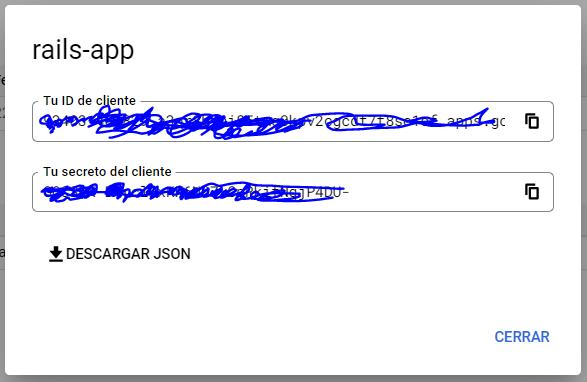

# Omniauth Google Account

This app was developed using Ruby on Rails 6.

## Software.

* Ruby 3.0
* Ruby on Rails 6.1.4.7
* Windows 10
* Heroku App.
* PostreSQL.
* VS Code.


## Description.

In order to developed this app, you will need to follow the next steps.
You must have access to Google Console to create the credentials.

### Setting Gemfile.

First of all, we need to add these gems into our Gemfile

* gem "omniauth-rails_csrf_protection"
* gem 'omniauth-google-oauth2'
* gem 'devise'
* gem 'sqlite' <-- Development group.
* gem 'pg' <-- Production group.

After that, run the command:
`bundle install --without production`

### Pages controller

I created a pages controller with the home page.
Go to routes.rb and set a page as the root of your application

### Heroku App.

Make a commit of your code and create a heroku app by typing the command: `heroku create`
Once you've done that, upload your code to production: `git push heroku master`

### Creaing Google Credentials.

Go to: https://console.cloud.google.com and sign up.
Go to **API and Services**, click on **Credentials** and select **ID Auth Client**.
You will need to create consent in order to create your credentials.
I suggest you select in create button within the consent page. It's easy to set all the configuration up.
You will have to name your web application and set the URI:

Javascript.

* http://localhost:3000
* https://obscure-cove-37849.herokuapp.com

URI

* http://localhost:3000/users/auth/google_oauth2/callback
* https://obscure-cove-37849.herokuapp.com/users/auth/google_oauth2/callback


Finally, you will need to copy the client ID and the secret ID.



## Rails Credentials.

Copy the keys generated in Google Console and paste it into your credentials file.
Use this command in order to open your credentials file: `EDITOR="code --wait" rails credentials:edit`

* google_id: 'Here goes the id client'
* google_secret: 'Here goes the secret key'

Once you've done that, save and close the file.
Use this command to see your credetnials: `rails credentials:show`

You can verify your credentials by openning rails console and
typing the next commands: `Rails.application.credentials.google_id`

## Generate Devise Model.

Run this command in order to install devise: `rails g devise:install`
Run this command to generate User model: `rails g devise User`
Run this command to generate Devise views: `rails g devise:views`


## Routes.rb file

Within config/routes.rb paste the next code:
```
root 'pages#index'

  get 'omniauth_test', to: 'home#display_omniauth'

  devise_for :users, controllers: {
                                    omniauth_callbacks: 'users/omniauth_callbacks',
                                    sessions: 'users/sessions'
                                  }
  devise_scope :user do
    get 'sign_out' => 'devise/sessions#destroy'
  end
```

## Controllers files.

